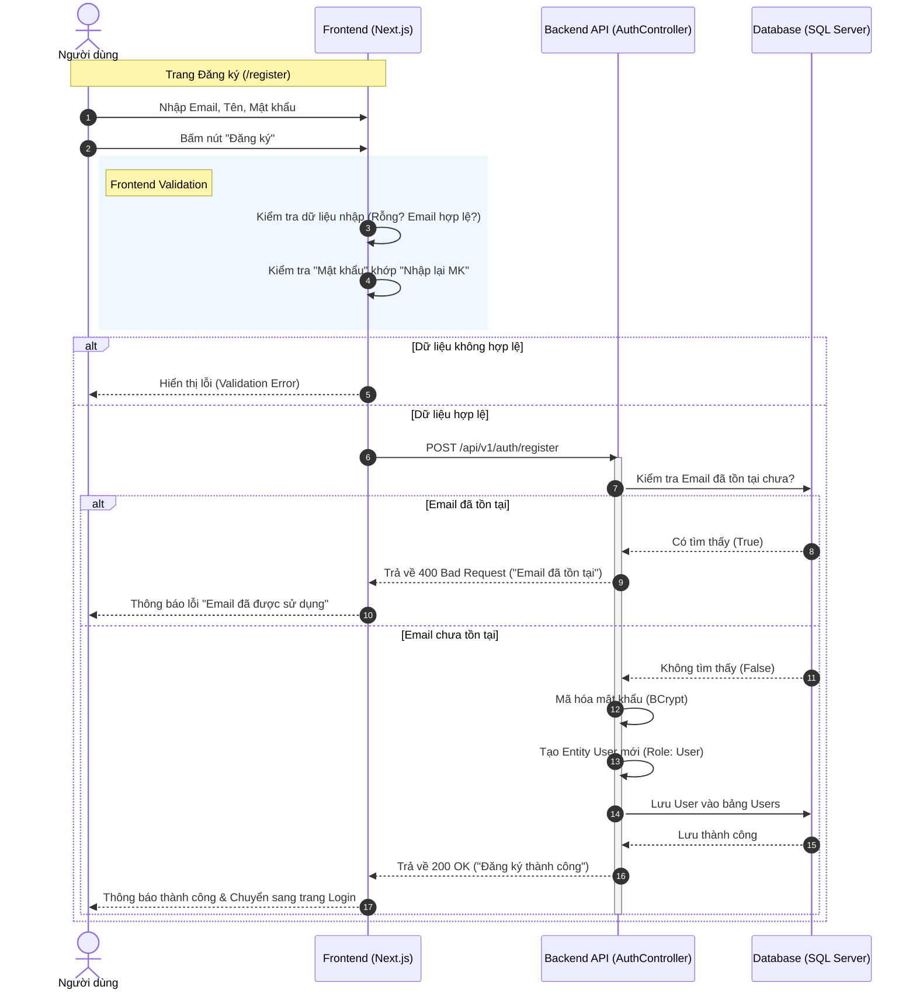

```mermaid

sequenceDiagram
    autonumber
    actor User as Người dùng
    participant FE as Frontend (Next.js)
    participant API as Backend API (AuthController)
    participant DB as Database (SQL Server)

    Note over User, FE: Trang Đăng ký (/register)

    User->>FE: Nhập Email, Tên, Mật khẩu
    User->>FE: Bấm nút "Đăng ký"
    
    rect rgb(240, 248, 255)
        note right of User: Frontend Validation
        FE->>FE: Kiểm tra dữ liệu nhập (Rỗng? Email hợp lệ?)
        FE->>FE: Kiểm tra "Mật khẩu" khớp "Nhập lại MK"
    end
    
    alt Dữ liệu không hợp lệ
        FE-->>User: Hiển thị lỗi (Validation Error)
    else Dữ liệu hợp lệ
        FE->>API: POST /api/v1/auth/register
        
        activate API
        API->>DB: Kiểm tra Email đã tồn tại chưa?
        
        alt Email đã tồn tại
            DB-->>API: Có tìm thấy (True)
            API-->>FE: Trả về 400 Bad Request ("Email đã tồn tại")
            FE-->>User: Thông báo lỗi "Email đã được sử dụng"
        else Email chưa tồn tại
            DB-->>API: Không tìm thấy (False)
            API->>API: Mã hóa mật khẩu (BCrypt)
            API->>API: Tạo Entity User mới (Role: User)
            API->>DB: Lưu User vào bảng Users
            DB-->>API: Lưu thành công
            API-->>FE: Trả về 200 OK ("Đăng ký thành công")
            
            FE-->>User: Thông báo thành công & Chuyển sang trang Login
        end
        deactivate API
    end

```